# CollectHub 🎒📃

<div align="center">
  <h2>Your personal collections. All in one place.</h2>
  <p><em>A unified platform to organize and store your personal collections</em></p>
  

<a href="https://collecthub.vercel.app/" target="_blank">
  
</a>


</div>

---

## 🚀 Overview

CollectHub is a comprehensive platform designed to help you organize, manage, and showcase your personal collections in one centralized location. Whether you're collecting games, YouTube channels, programming languages, or any other items, CollectHub provides the tools you need to keep everything organized.

---

## 📸 Screenshots

### Welcome Screen
<div align="center">
  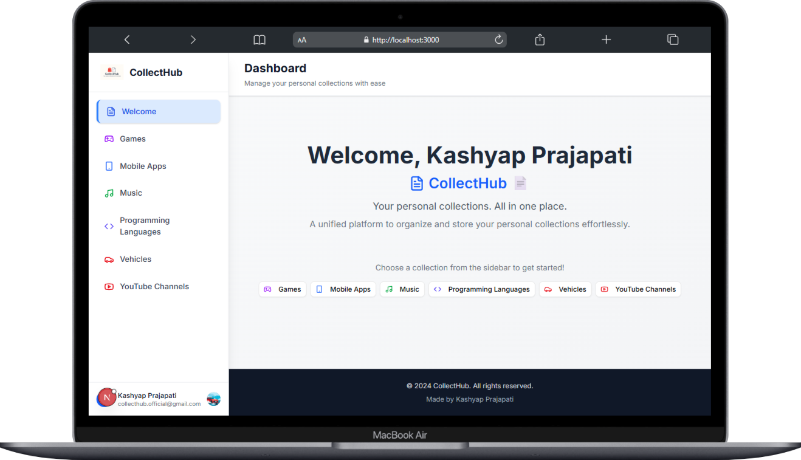
  <p><em>Desktop Welcome Screen</em></p>
  
  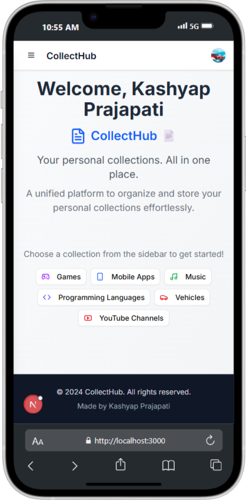
  <p><em>Mobile Welcome Screen</em></p>
</div>

---

### Collection Management Views

#### 🎮 Games Collection
<div align="center">
  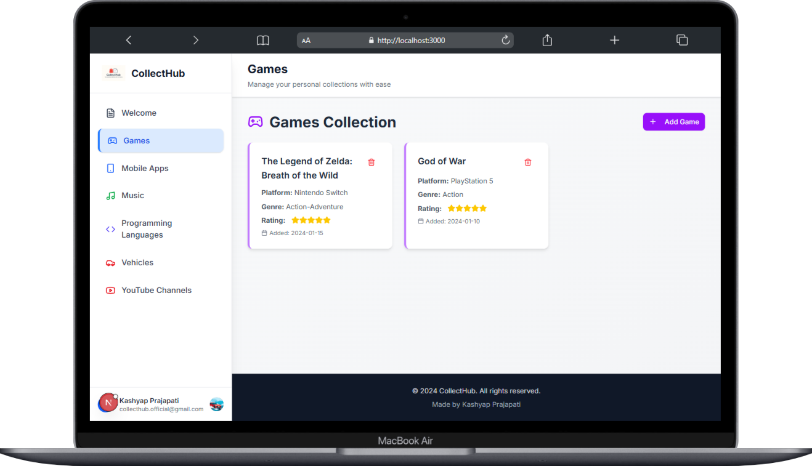
  <p><em>Games Collection Management - Desktop View</em></p>
  
  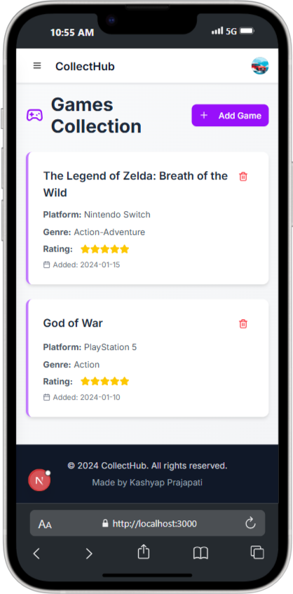
  <p><em>Games Collection Management - Mobile View</em></p>
</div>

##### Games Collection CRUD Operations
<div align="center">
  
  <p><em>Games Collection Welcome Screen</em></p>
  
  
  <p><em>Add New Game Form</em></p>
  
  
  <p><em>Game Added Successfully</em></p>
  
  
  <p><em>Update Game Information</em></p>
  
  
  <p><em>Game Updated Successfully</em></p>
  
  
  <p><em>Delete Game Confirmation</em></p>
  
  
  <p><em>Game Deleted Successfully</em></p>
</div>

---

#### 🎵 Music Collection
<div align="center">
  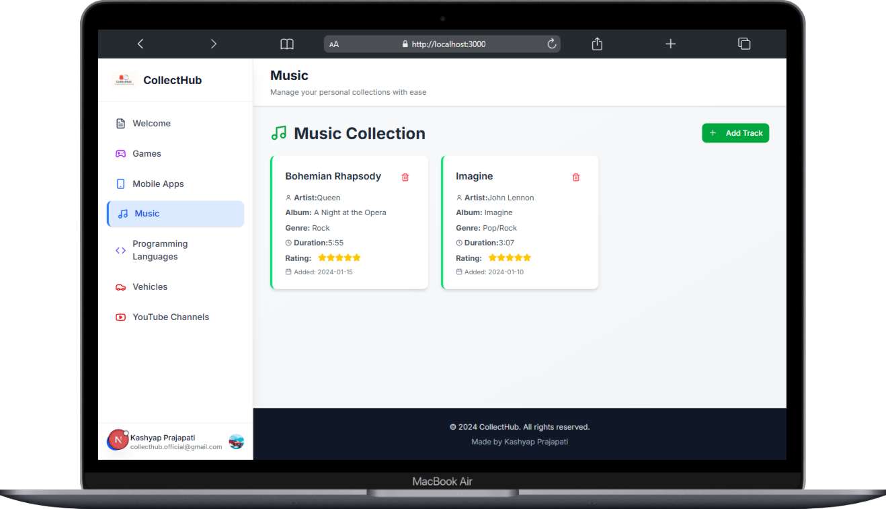
  <p><em>Music Collection Management - Desktop View</em></p>
  
  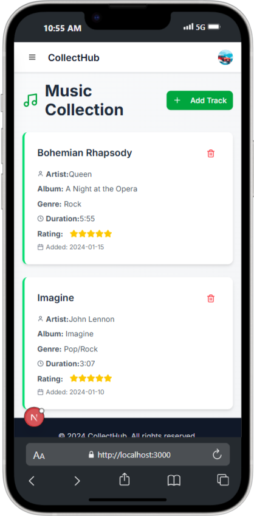
  <p><em>Music Collection Management - Mobile View</em></p>
</div>

---

#### 💻 Programming Collection
<div align="center">
  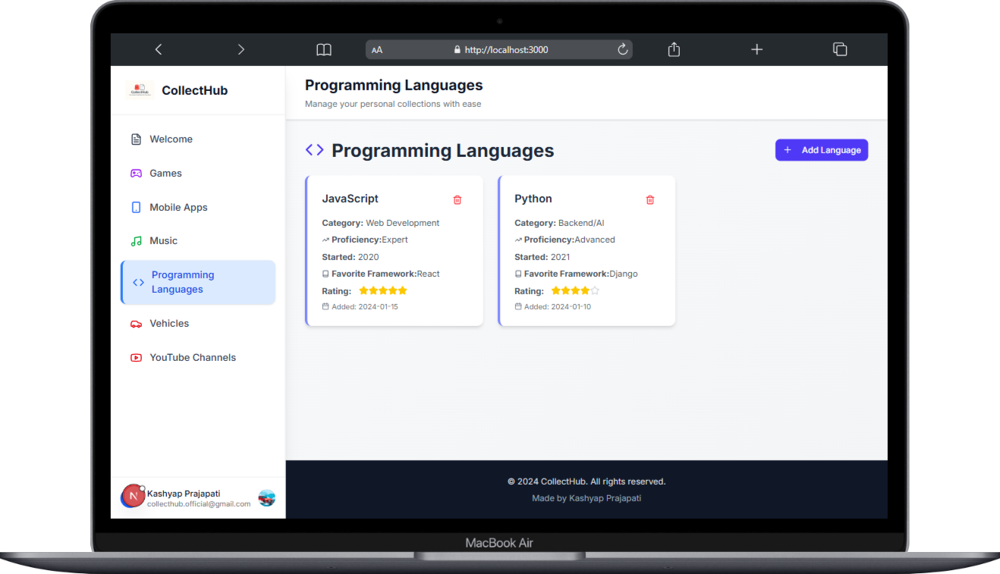
  <p><em>Programming Collection Management - Desktop View</em></p>
  
  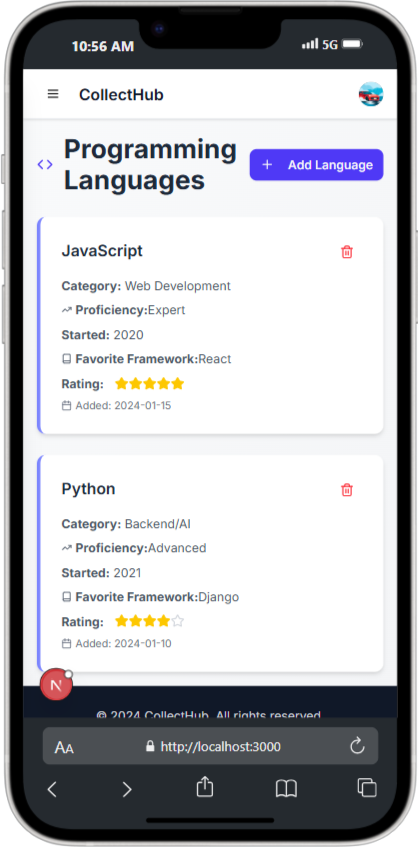
  <p><em>Programming Collection Management - Mobile View</em></p>
</div>

---

#### 🚗 Vehicles Collection
<div align="center">
  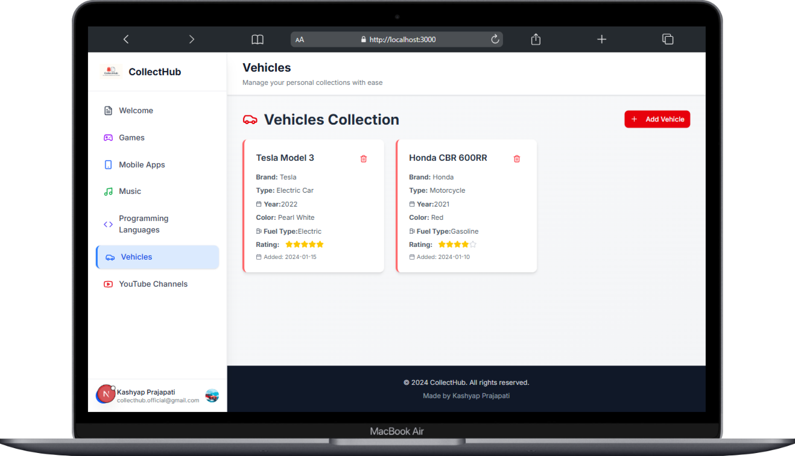
  <p><em>Vehicles Collection Management - Desktop View</em></p>
  
  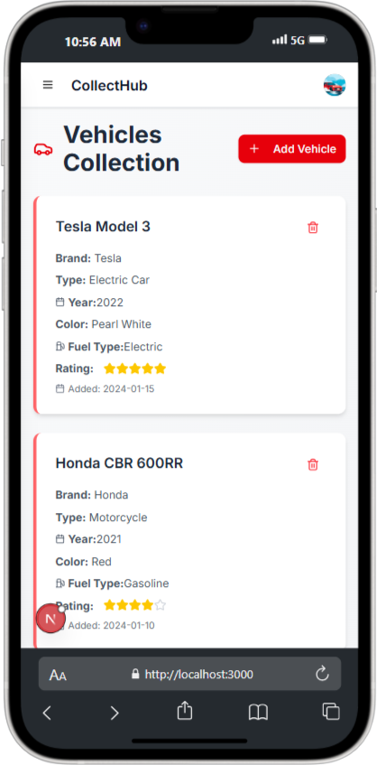
  <p><em>Vehicles Collection Management - Mobile View</em></p>
</div>

---

#### 📺 YouTube Collection
<div align="center">
  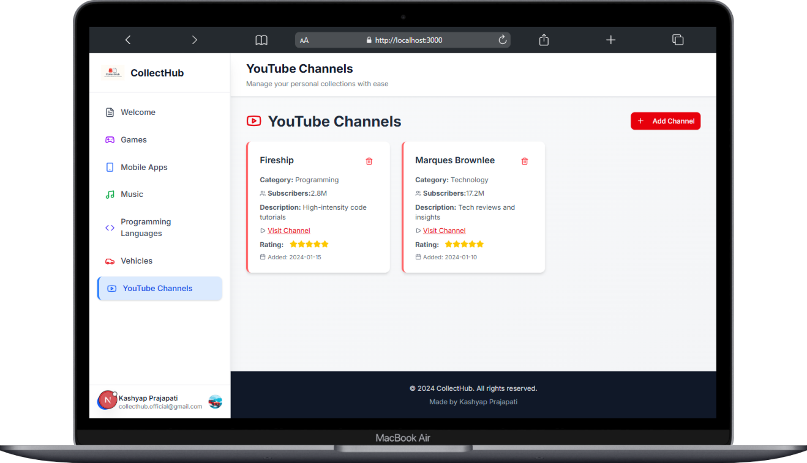
  <p><em>YouTube Collection Management - Desktop View</em></p>
  
  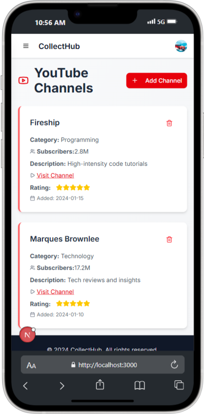
  <p><em>YouTube Collection Management - Mobile View</em></p>
</div>

---

#### 📱 Mobile Apps Collection
<div align="center">
  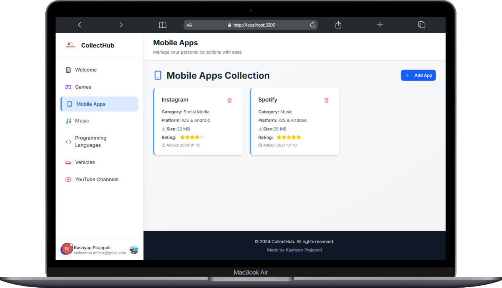
  <p><em>Mobile Apps Collection Management - Desktop View</em></p>
  
  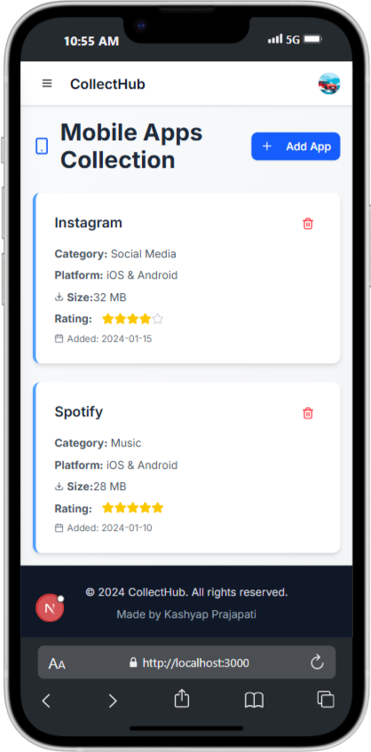
  <p><em>Mobile Apps Collection Management - Mobile View</em></p>
</div>

---

## 🛠️ Tech Stack

- **Frontend**: Next.js, React
- **Styling**: Tailwind CSS
- **Deployment**: Vercel
- **Package Manager**: npm

---

## 🚀 Getting Started

### Prerequisites
- Node.js (v18 or higher)
- npm or yarn

### Installation

1. **Clone the repository**
   ```bash
   git clone https://github.com/kashyapprajapat/collecthub-frontend.git
   cd collecthub-frontend
   ```

2. **Install dependencies**
   ```bash
   npm install
   ```

3. **Set up environment variables**
   ```bash
   cp .env.example .env
   # Configure your environment variables
   ```

4. **Run the development server**
   ```bash
   npm run dev
   ```

5. **Open your browser**
   Navigate to `http://localhost:3000`

---

## 📝 Available Scripts

- `npm run dev` - Start development server
- `npm run build` - Build for production
- `npm start` - Start production server
- `npm run lint` - Run ESLint

---

## 🐳 Docker Support

Build and run with Docker:

```bash
# Build the image
docker build -t collecthub .

# Run the container
docker run -p 3000:3000 collecthub
```

---

## 🤝 Contributing

Contributions are welcome! Please feel free to submit a Pull Request.

1. Fork the project
2. Create your feature branch (`git checkout -b feature/AmazingFeature`)
3. Commit your changes (`git commit -m 'Add some AmazingFeature'`)
4. Push to the branch (`git push origin feature/AmazingFeature`)
5. Open a Pull Request

---

<div align="center">
  <h3>🌟 If you found this project helpful, please give it a star! 🌟</h3>
  
  **Made with ❤️ by [Kashyap Prajapat](https://github.com/kashyapprajapat)** ☕👨🏻‍💻🧋
  
  <a href="https://collecthub.vercel.app/" target="_blank">Live Demo</a> •
  <a href="#-getting-started">Getting Started</a> •
  <a href="#-contributing">Contributing</a>
</div>